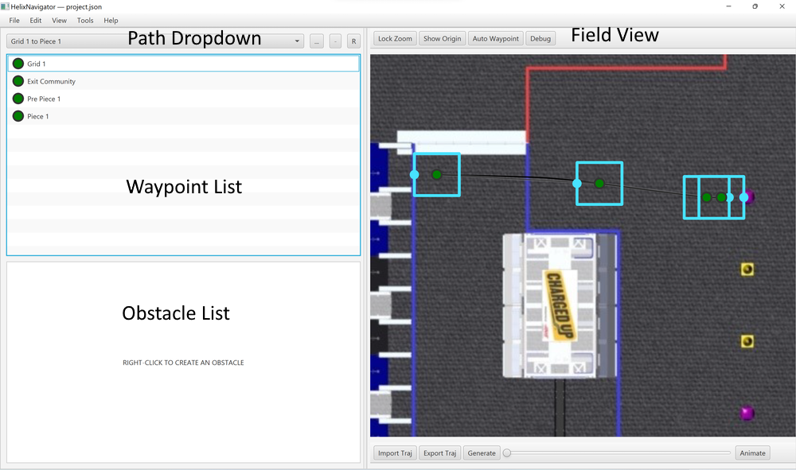
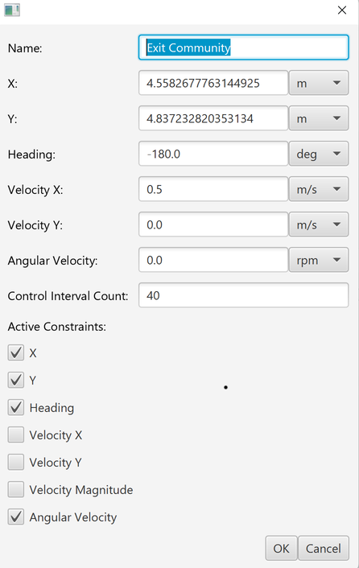

# Robojackets 3538 Software for The 2023 FRC Season, Charged Up

## Trajectory Generation

### Requirements

* [2023 WPILib VS Code](https://docs.wpilib.org/en/stable/docs/zero-to-robot/step-2/wpilib-setup.html)
* [Docker Desktop](https://docs.docker.com/desktop/install/windows-install/)
* [Helix Navigator](https://github.com/TripleHelixProgramming/HelixNavigator/actions/runs/4157180559) (must be logged in to Github to download installer)

### General Workflow

1. Open this project in `2023 WPILib VS Code`.
2. Within Helix Navigator, open `trajectories/project.json` located within this repository.
3. Select the Path you wish to edit from the dropdown.
4. Run the task `Trajectories: Generate Matching Name` from within VS Code, providing the path name as an argument.
    * This is accessible from the Command Palette (`ctrl+shift+p`) under `Tasks: Run Task`.
5. Open the generated trajectory, located at `trajectories/project-<PATH NAME>.path.json`
6. Repeat Steps 3-5 as desired.

* You may also generate all paths located within `trajectories/project.json` by running the task `Trajectories: Generate All`.

### Recommendations

* Install keybindings for Trajectory Generation
  * Recommended keybindings are provided in `keybindings.json`, these can be copied into your own Keyboard Shortcuts.
  * In particular:
    * `ctrl+'` = Generate All Trajectories
    * `ctrl+shift+'` = Generate Trajectories from Path name prefix / suffix (Empty is no-op)

### Using Helix Navigator

#### User Guide

* How can I create a new path?
  * Use the `+` button next to the path dropdown.
* How can I add waypoints to a path?
  * `Right-click` on the Waypoint List.
  * `Right-click` on a particular waypoint gives you the option to insert a new waypoint before or after the current waypoint.
  * `ctrl+c ctrl+v` to duplicate a waypoint.
    * When dragging duplicated waypoints, if they are overlapping, the waypoint that comes later in the path is dragged.
* How can I update waypoints?
  * `Right-click` -> `Edit`
    * Works in Waypoint List and on Field view.
  * `click+drag` on the center of a waypoint (green circle) to move a waypoint around.
  * `click+drag` on the blue border of a waypoint to adjust the heading. This snaps to 90 degree angles when near them.
* How can I view a generated trajectory?
  * Use the `Import Traj` button below the Field view, and select the associated generated path file.
  * Drag the slider below the Field view to visualize the robot's pose along the path.
  * Toggle the `Animate` button to view the velocity of the robot as it follows the path. The animation is played 1:1 with the generated path duration.

#### Custom Waypoints

* __Name__: The name of the waypoint. Give it a good one!
* __X__: The X Position of the waypoint. 0 is at the left (Wall nearest the Blue Alliance Driver Stations).
* __Y__: The Y Position of the waypoint. 0 is at the bottom (Wall nearest the Scoring Table).
* __Heading__: The direction the Robot faces at this waypoint. 0 is facing +X, and grows more positive in the Counter-Clockwise direction.
* __Control Interval__: Set this to 40, typically. A little larger for longer segments, a little smaller for shorter segments. __Set this to 0 for the initial Waypoint__!
* __Active Constraints__
  * __Important__: Checkmark all of these for the first and last waypoints.
  * __If selected__, the path _must_ match the given property at this waypoint.
  * __If unselected__, the path will use this property of the waypoint as an initial guess.

### Tips and Tricks for Trajectory Generation

* Name your waypoints!
  * Left-click on a waypoint to rename it.
  * Giving waypoints names helps to tie them to their position on the field.
* The Velocity fields on the initial and final waypoints should all be 0.
* Important notes: [TripleHelixProgramming/HelixNavigator#9](https://github.com/TripleHelixProgramming/HelixNavigator/issues/9#issuecomment-1426500185)
  * Summary:
    * Set the __Control Interval__ on the first waypoint to 0. Set the remainder to ~40.
    * Only use `Custom` waypoints.
* Constrain only what you must, but thoroughly inform the optimizer of where it should be looking.
  * Make sure to check that each property of the inner waypoints are set to a reasonable guess, or are constrained.
    * X, Y and Heading guesses can be checked visually.
    * Velocity X, Velocity Y, and Angluar Velocity should be set based on the direction you expect the robot to drive through the waypoint. They are field-centric rather than robot-centric, so no tricky business.
* Don't use Obstacles ~~unless _absolutely_ necessary~~
  * They add significant additional overhead to the entire path and cause a major reduction in performance. We can generate equivalent paths without them by adding additional waypoints with constraints.
* If it takes more than a half minute to generate a trajectory, you're best off cancelling the task (`ctrl+c`) and inspecting the path to see where you can provide better guidance to the path generator. Ideally, we can generate all paths together within a minute. The optimizer is capable, we just need to give it good suggestions.
